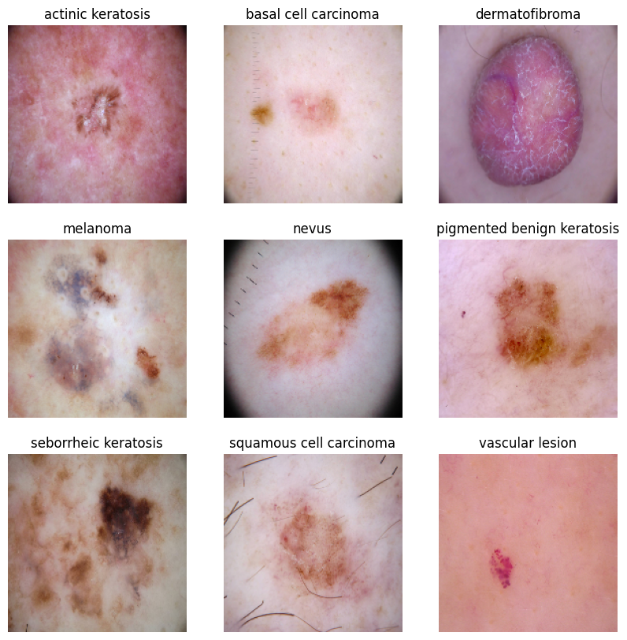

# Melanoma-Detection-Assignment
>
> This project aims to develop a convolutional neural network (CNN) for accurately detecting melanoma, a deadly type of skin cancer. Melanoma accounts for a significant portion of skin cancer deaths, underscoring the importance of early detection. By leveraging image evaluation techniques, the model seeks to alert dermatologists about the presence of melanoma, potentially reducing the manual effort required for diagnosis.

## Table of Contents
* [General Info](#general-information)
* [Technologies Used](#technologies-used)
* [Conclusions](#conclusions)
* [Acknowledgements](#acknowledgements)

## General Information

### Dataset Information

The dataset comprises 2357 images encompassing various malignant and benign oncological diseases, compiled by the International Skin Imaging Collaboration (ISIC). Each image is categorized based on ISIC classification, with an equal distribution across most disease types, except for melanomas and moles, which exhibit a slight dominance.  

The dataset encompasses a range of diseases including:

- Actinic keratosis
- Basal cell carcinoma
- Dermatofibroma
- Melanoma
- Nevus
- Pigmented benign keratosis
- Seborrheic keratosis
- Squamous cell carcinoma
- Vascular lesion

#### Sample Images

## Steps

- Data Reading/Data Understanding
- Dataset creation
- Dataset visualisation
- Model Building & Training
- Data Augmentation
- Class Distribution Analysis in the Training Dataset
- Handling class imbalances
- Model Building & Training on Augmented Data
- Test Model

### Algorithms

Convolutional Neural Network (CNN)

## Results

### Base Model

Visualization of Accuracy and Loss Trends in the base model

### Augmented Model

Visualization of Accuracy and Loss Trends in the argumented model

### Final Model (On Argumented Data)

Visualization of Accuracy and Loss Trends in the final model

# Conclusion

The observed trend indicates that as the model's accuracy improves, its loss decreases, demonstrating a positive correlation between accuracy and loss reduction. The final model achieved an impressive accuracy of 88% with a corresponding loss of 0.4, signifying its efficacy in accurately predicting lesion classes. The augmentation of data and mitigation of class imbalance notably contributed to the enhanced performance of the model, underscoring the importance of these strategies in improving model accuracy and robustness.

# Technologies Used

- Python
- Pathlib
- Tensorflow
- Matplotlib
- Numpy
- Pandas
- Glob
- Keras
- Seaborn
- Augmentor

## Acknowledgements
- An Introduction to Convolutional Neural Networks (CNNs)
    - https://www.datacamp.com/tutorial/introduction-to-convolutional-neural-networks-cnns

- Image Classification Using CNN: Introduction and Tutorial
    - https://datagen.tech/guides/image-classification/image-classification-using-cnn/

# Contact

Created by [@waiyanminkhaing] - feel free to contact me!
